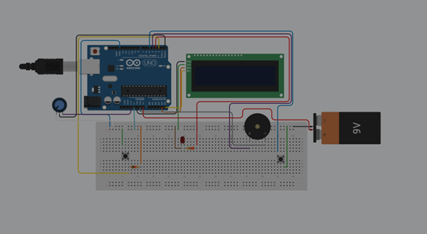

<h1 align="center">🔤 Morse Code Interpreter</h1>

  An embedded systems project that converts Morse code signals into readable text ⚡

---

## 🚀 Overview
This project focuses on interpreting Morse code signals and converting them into human-readable text using embedded system logic.  
It combines circuit design, signal processing, and real-time decoding to demonstrate practical engineering implementation.

---

## 🎯 Key Objectives
- Detect Morse code inputs (dots and dashes)  
- Interpret signal patterns accurately  
- Convert signals into readable characters  
- Gain hands-on experience in embedded systems and signal processing  

---

## ⚙️ Hardware Components
- Arduino  
- Buzzer  
- Potentiometer  
- Breadboard  
- Jumper Wires  

---

## 🧠 Technologies & Concepts
- Embedded Systems  
- Signal Processing  
- Circuit Design  
- Proteus Simulation  

---

## 🔌 Circuit Diagram

  

---

## 🔄 System Flowchart

  

---

## 💻 Source Code
The Arduino source code for this project is available in the `code/` folder.

---

## 📄 Documentation
Detailed project notes and additional materials can be found in the `docs/` folder.

---

## ✨ Highlights
- Real-time Morse code decoding  
- Adjustable sensitivity using potentiometer  
- Practical implementation of signal-based communication  
- Clean and modular project structure  

---

## 🔮 Future Improvements
- LCD display integration  
- Improved noise filtering  
- More accurate signal detection  
- Expanded Morse character support  

---

## 📬 Contact
- 📧 Email: berenkurt@gmail.com  
- 💼 LinkedIn: https://www.linkedin.com/in/beren-kurt
